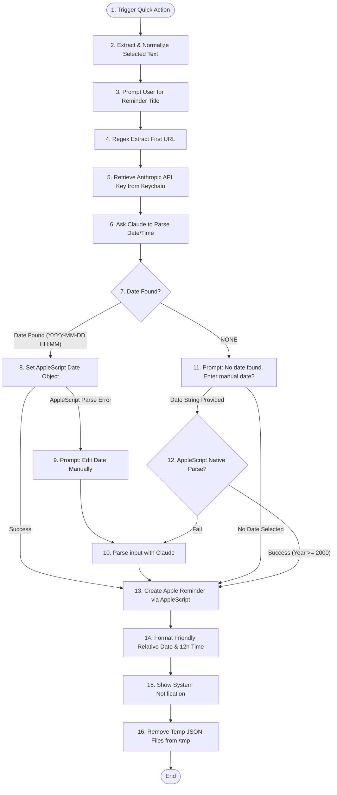

# Add to Reminders (Mac Quick Action)

A macOS Automator Quick Action that allows you to seamlessly add selected text from anywhere on your Mac directly into your Apple Reminders app. 

It uses AI (Claude by Anthropic) to extract and understand natural language dates hidden within your text, parsing them to properly schedule your reminders.

---

## System Architecture & Logical Flow

The workflow acts as an orchestration layer written in AppleScript, running shell scripts, calling the Anthropic API, executing Python handlers, and interacting with native macOS system apps.



---

## Detailed Logic Breakdown

### 1. Ingestion & Text Sanitization
* **Text Extraction**: The AppleScript acts as the Automator entry point, binding selected text into `theText`. It handles variation in Automator's input delivery (handling either a list representation or a raw string).
* **Sanitization**: Raw text copied from web pages or emails often contains messy line breaks and double spacing. The script normalizes the selected text via a shell pipeline:
  ```bash
  echo <text> | tr '\n' ' ' | sed 's/^[[:space:]]*//;s/[[:space:]]*$//;s/[[:space:]]\{2,\}/ /g'
  ```
  This replaces all carriage returns/newlines with single spaces, trims leading/trailing whitespace, and collapses multiple spaces into a single space.

### 2. Interactive Title Input
* The user is prompted with a dialog to name the reminder. The default title is pre-filled with the sanitized input text, letting the user keep it, prune it, or replace it entirely.

### 3. URL Extraction
* A background regular expression searches the sanitized text for the first URL starting with `http` or `https`:
  ```bash
  echo <text> | grep -oE 'https?://[^ ]+' | head -1
  ```
  If a URL is matched, it is saved to be appended to the reminder's Notes/Body parameter.

### 4. AI Date Extraction Engine
* The script reads your Anthropic API Key directly from your macOS generic Keychain.
* It formats a dynamic JSON payload asking the model `claude-sonnet-4-6` to parse the text. Today's date is injected in `YYYY-MM-DD` format to resolve relative terms (e.g. "tomorrow", "next tuesday").
* **JSON Escaping Safeguard**: Injecting arbitrary user selection text into a curl JSON payload invites syntax errors. To prevent this, the script runs a Python script to safely serialize the prompt text:
  ```bash
  python3 -c "import json,sys; print(json.dumps(sys.argv[1]))" <prompt> > /tmp/claude_prompt.json
  ```
* **API Call**: The script uses `curl` to request the API.
* **Regex Filtering**: A Python script is run on the response to look for a strict pattern matching `YYYY-MM-DD HH:MM`. If matched, it returns it; otherwise, it returns `NONE`.

### 5. Date Parsing & Calendar Bug Prevention
* **AppleScript Calendar Bug Protection**: AppleScript dates are notoriously sensitive to current date parameters. For instance, if today is the 31st of May, setting the month of a new date object to `2` (February) will immediately overflow the date to March 3rd. To prevent this calendar bug, the script forces the day value of the target date object to `1` *before* modifying month and year, then restores the correct target day:
  ```applescript
  set theDate to current date
  set time of theDate to 0
  set day of theDate to 1 -- Prevents calendar overflow
  set year of theDate to targetYear
  set month of theDate to targetMonth
  set day of theDate to targetDay
  ```

### 6. Fallback and Recovery Logic
* **Claude Fails to Find Date**: If Claude returns `NONE`, the script prompts the user with an input dialog preset with tomorrow's date at 7:00 AM.
* **Manual Date Resolution**: 
  1. The script first attempts a native AppleScript date parsing: `set theDate to date manualInput`.
  2. If it succeeds, it verifies that the parsed year is greater than or equal to 2000 (preventing invalid two-digit abbreviation anomalies).
  3. If native parsing fails, the script triggers a fallback AI parsing routine (`parseDateWithAI`) to let Claude interpret the manual entry.

### 7. Native Creation & User Notification
* **Reminders Integration**: The script communicates directly with Apple's native Reminders database via standard AppleScript dictionaries, passing title, URL (notes), and due date.
* **Friendly Notification Display**: It formats the final confirmation message:
  * Compares the final date to today and tomorrow to display relative markers ("Today", "Tomorrow", or the short date string).
  * Converts the 24-hour time to a user-friendly 12-hour AM/PM string.
  * Triggers a system notification.

### 8. Cleanup
* Deletes `/tmp/claude_prompt.json` and `/tmp/claude_response.json` files securely to avoid cluttering local memory.

---

## Setup Requirements

1. **Anthropic API Key**: An active API Key from console.anthropic.com.
2. **Secure Keychain Storage**: The key must be saved to your macOS Keychain with the service name `anthropic_api_key`. Add it securely via Terminal:
   ```bash
   security add-generic-password -a $USER -s anthropic_api_key -w "YOUR_API_KEY_HERE"
   ```

---

## Editing & Customization

Quick Actions are saved in a hidden folder inside your library directory: `~/Library/Services/`

**To Edit the Workflow:**
1. Launch **Automator** on your Mac.
2. Go to **File > Open** (or press `Cmd + O`).
3. Press `Cmd + Shift + G`, paste `~/Library/Services/`, and click Go.
4. Select `Add to Reminders.workflow` to open and modify it.
5. Save (`Cmd + S`) to instantly register updates system-wide.
